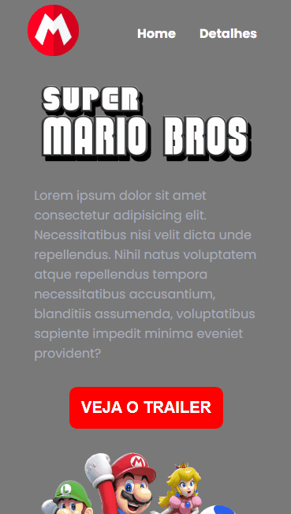

<h1 align="center">Landing Page do Super Mario</h1>
 

### 🚨 Sobre o Projeto

O projeto é um desafio proposto em um curso que estou realizando para aprimorar meus conhecimentos em HTML, CSS e JavaScript. Ele consiste na criação de uma Landing Page do filme Super Mario, o projeto foi desenvolvido com o objetivo de colocar em prática os conhecimentos adquiridos no curso em que estou fazendo.

<strong>Link:<strong> https://joaonodari.github.io/landingPageSuperMario/

### 🔨 Ferramentas Utilizadas

* [HTML](https://developer.mozilla.org/pt-BR/docs/Web/HTML)
* [CSS](https://developer.mozilla.org/pt-BR/docs/Web/CSS)
* [JSS](https://developer.mozilla.org/pt-BR/docs/Web/JavaScript)

### 📽️ Projeto 

    </img>
    
Landing Page aberta no Desktop

 
 

    </img>
    
Landing Page aberta no Mobile

